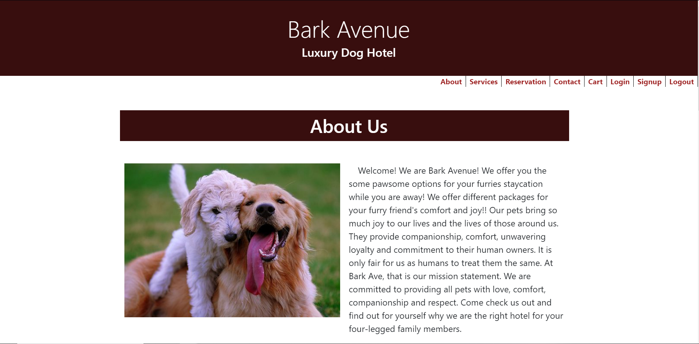
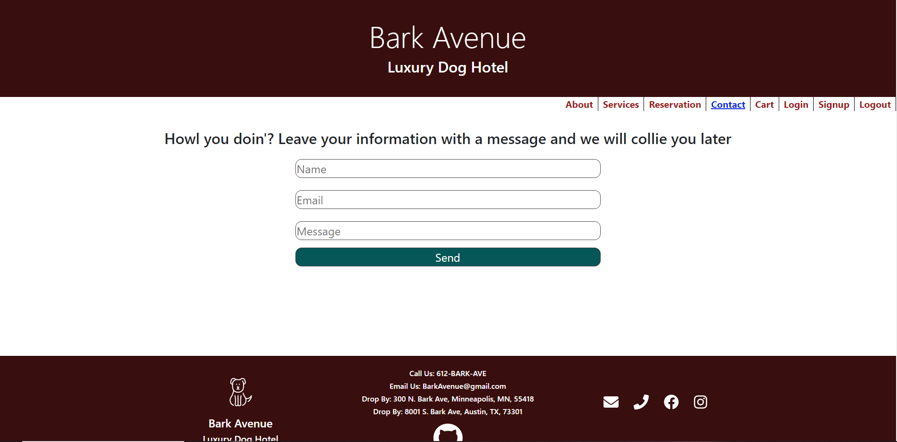
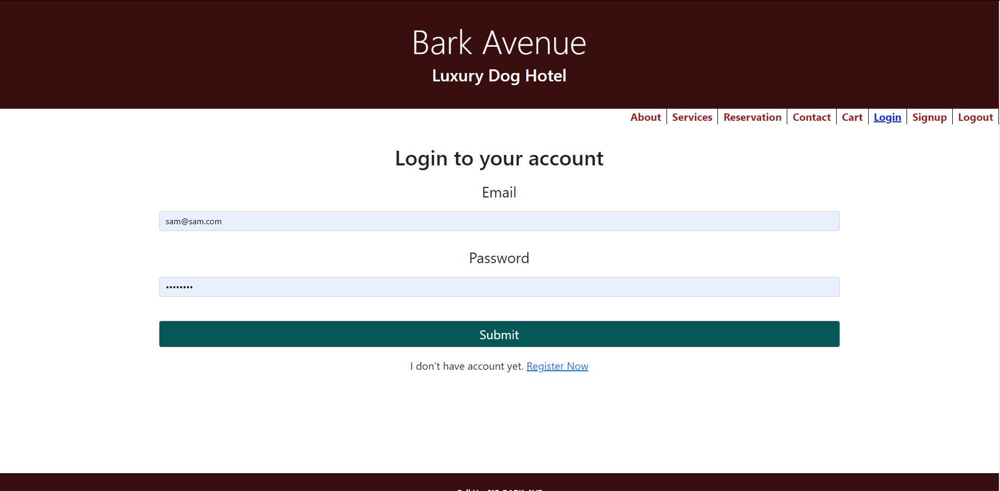
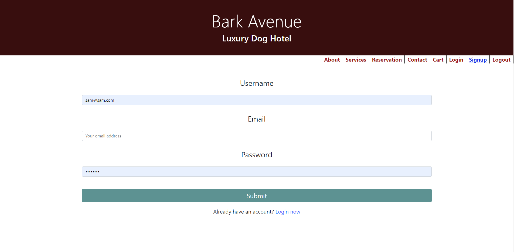

# barkAvenue
[](https://github.com/blen90/barkAvenue)
  
# Description

Bark Avenue is a website built for a pet hotel using Reactjs. With this react app the user can sign up, log in, set their pets name, check out the services offered, select a service, book a reservation, and add it to the cart. Bark Avenue is a luxury hotel for dogs with future plans of allowing cats and other four-legged friends.

 



    
# Table of Contents

* [Installation](#installation)
    
* [Usage](#usage)

* [License](#license)

* [Contributing](#contributing)

* [Technology](#Technology)

* [Questions](#questions)
    
# Installation
Clone the repo to your local machine.

Run ```npm install``` to install dependencies.

Run ```npm start``` to start the application.

# Usage

Head to the signup page to register a new user. At any point the user can logout after creating an account. If not logged in but have created an account then login. View the services offered on the services page and select one, this will redirect you to the reservation page where you can select dates, then add to cart and checkout.

# License

This application is covered by the MIT license.
    
# Contributing

Contributors: Hewan Redie, Blenda Orellana, Yueshia (Cody) Vue, and Samuel Montague

# Technology

MongoDB 
    - used to host the data. Built for modern application developers.

React 
    - website is built using react framework and components.
    - State and Effect Hooks
    - Context

CSS
    -our main styling tool, with the addition of reactstrap for more seemless cohesion.
    
# Questions

If you have any questions about the repo, open an issue or contact us directly at Hewan Redie:tewol22@gmail.com, Blenda Orellana: blen.or90@gmail.com, Yueshia Vue: YueshiaVue@gmail.com, Samuel Montague: SamuelpMontague@gmail.com. You can find more of our work at (https://github.com/blen90) (https://github.com/Tewol) (https://github.com/YueshiaVue) (https://github.com/SamuelMontague/).