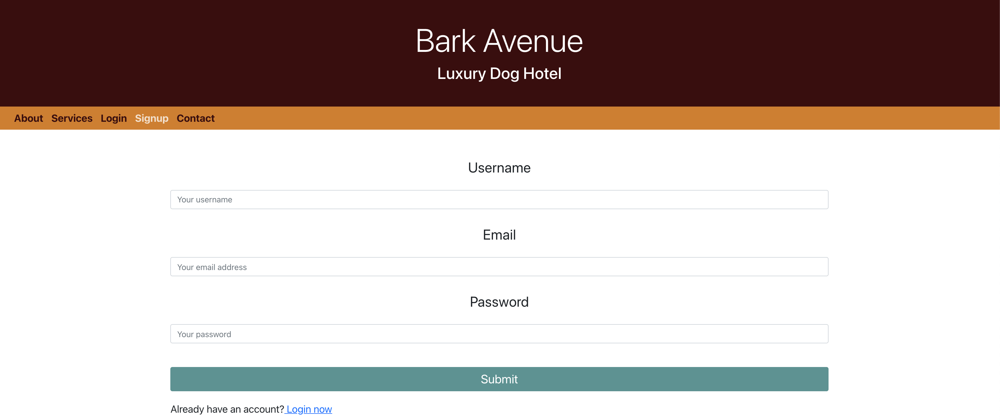
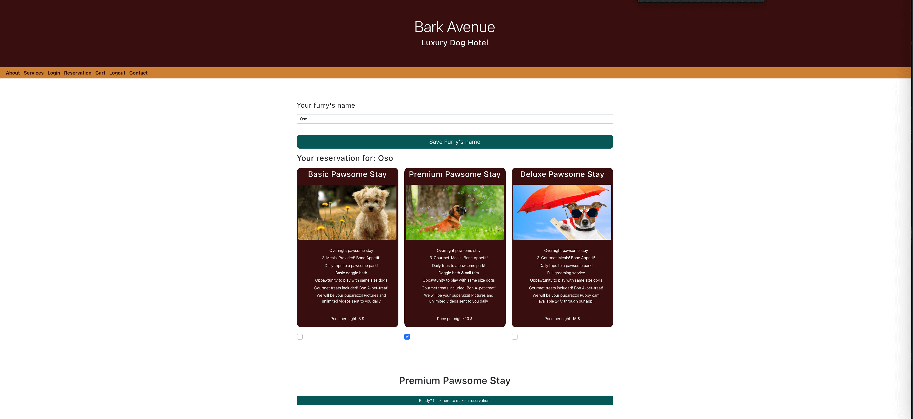
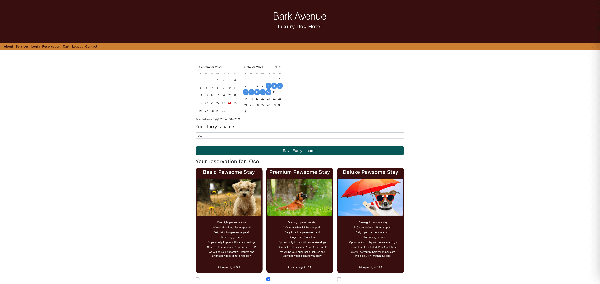
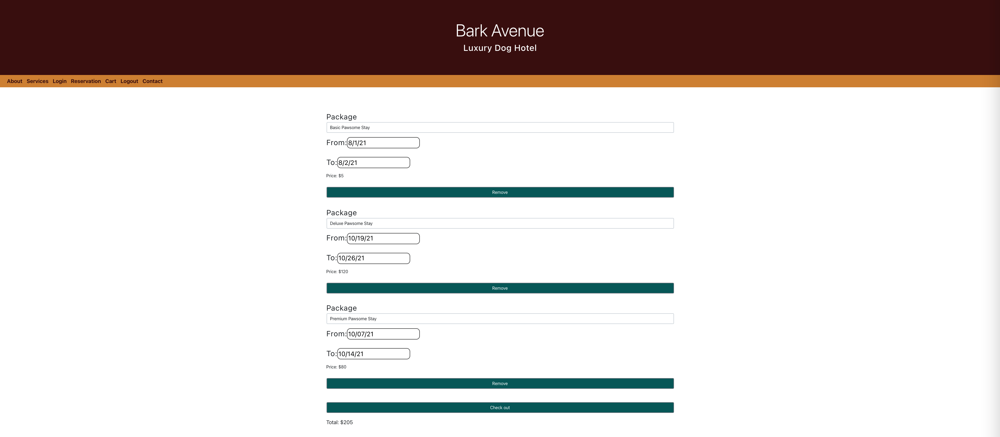
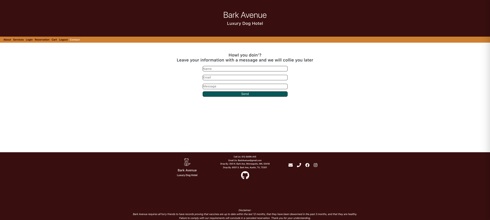

# Bark Avenue
[](https://github.com/blen90/barkAvenue)
  
# Description

Bark Avenue is a luxury hotel for dogs that utilizes ReactJs, MongoDB and CSS. This app allows the user to sign up, or log in, set their pet's name, view the services that are offered, the user can then select a service to book a reservation, the user ca add their choices to the cart, update the cart and proceed to payment (right now it's a placeholder form) which shows a summary of the reservation details and the total for the reservation.

## Deployed App link

https://bark-avenue.herokuapp.com/

## Screenshots of the app


### About page

### Signup page

### Login page

### Services page

### Reservations page


### Cart page

### Checkout page

### Contact page

    
# Table of Contents

* [Installation](#installation)
    
* [Usage](#usage)

* [License](#license)

* [Contributors](#contributors)

* [Technology](#Technology)

* [Questions](#questions)
    
# Installation
Clone the repo to your local machine.

Run ```npm install``` to install dependencies.

Run ```npm start``` to start the application.

# Usage

Head to the signup page to register a new user. At any point the user can logout after creating an account. If not logged in but have created an account then login. View the services offered on the services page and select one, this will redirect you to the reservation page where you can select dates, then add to cart and checkout.

# License

This application is covered by the MIT license.
    
# Contributors

Contributors: Hewan Redie, Blenda Orellana, Yueshia (Cody) Vue, and Samuel Montague

# Technology

* MongoDB 
    - used to host the data. Built for modern application developers.

* React 
    - The App is built using react framework and components.
    - State and Effect Hooks
    - Context

* CSS
    -Css was the main styling tool, with the addition of reactstrap for amore seemless cohesion.
    
# Questions

If you have any questions about the repo, open an issue or contact us directly at:
* Hewan Redie:tewol22@gmail.com
* Blenda Orellana: blen.or90@gmail.com
* Yueshia Vue: YueshiaVue@gmail.com
* Samuel Montague: SamuelpMontague@gmail.com. 

You can find more of our work at 
* https://github.com/blen90
* https://github.com/Tewol
* https://github.com/YueshiaVue
* https://github.com/SamuelMontague/

